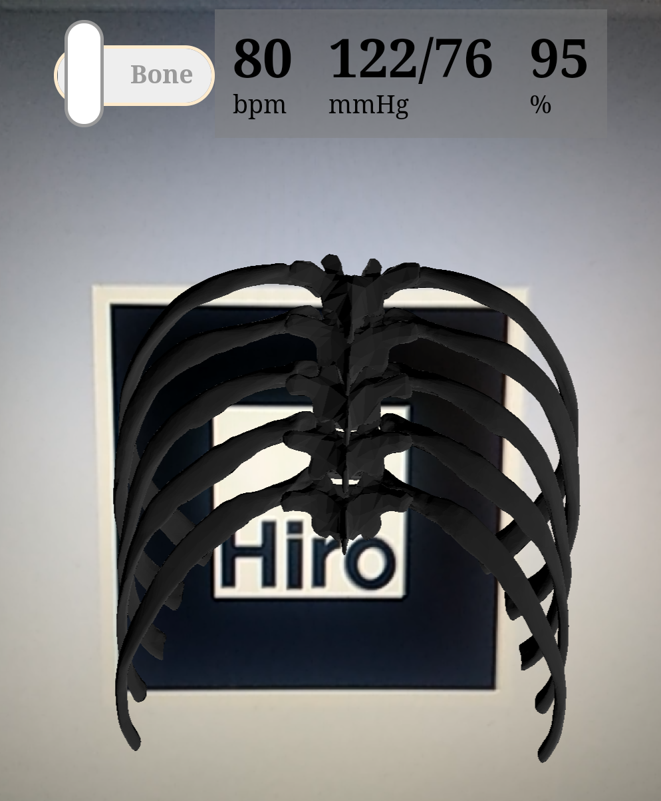
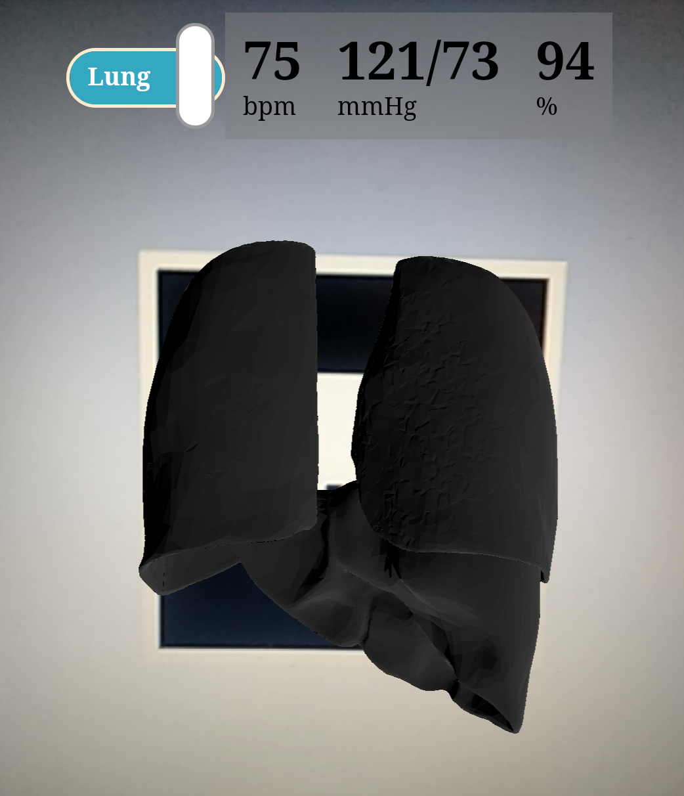
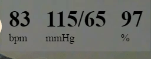
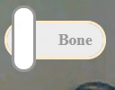

# Thoracentesis-AR
An AR helper to perform Thoracentesis. 

## Introduction

Thoracentesis is an invasive procedure to remove fluid or air from the pleural space for diagnostic or therapeutic purposes. A cannula, or hollow needle, is carefully introduced into the thorax, generally after administration of local anesthesia. The procedure is typically done while the patient is sitting. The fluid from the pleural cavity is aspirated via a three-way tap. 

## Deployment Instructions

All the necessary files to be hosted are kept in the dist folder. They are deployed [here](https://gurudhanush.github.io/Thoracentesis-AR/).

### steps
* Get the hiro marker [png](./hiro.png) or [pdf](./hiro.pdf). Keep it open
* Open the demo [https://gurudhanush.github.io/Thoracentesis-AR/](https://gurudhanush.github.io/Thoracentesis-AR/).
* Allow the camera permission. If you are in desktop resize the window to half to see the controls. 
* Point the camera at the marker, you will see the ribcage projection. Switch the mode to bone and see the lung projection

Best viewed in mobile device
  
## Demo

### Bone Mode

### Lung Mode

### video

### stats

Shows the heart rate (beats per minute), Blood pressure (mmHg) and oxygen saturation (%).

### Mode switch

Switching between Bone and Lung Mode

## Hiro Marker

Point the camera here

Made using [A-Frame](https://aframe.io/ "aframe"), [AR.js](https://github.com/jeromeetienne/AR.js) & [three.js](https://threejs.org/). 

